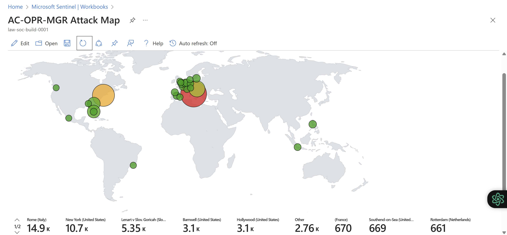
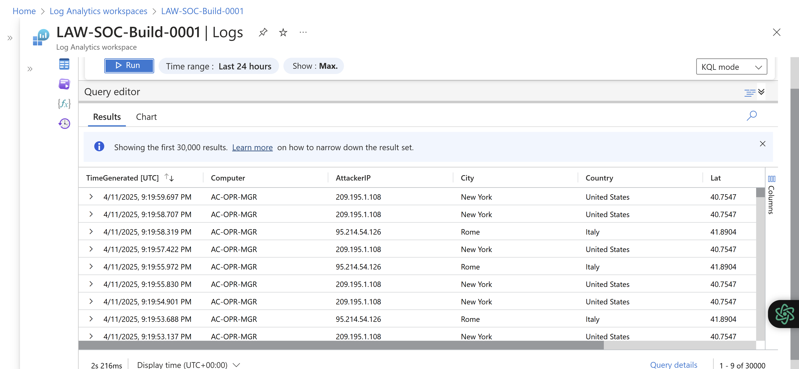
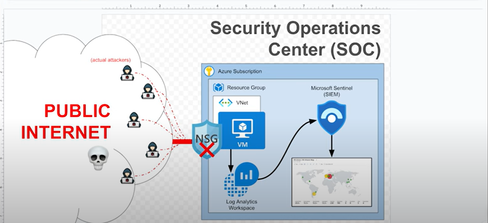

# SIEM Homelab: Threat Detection Lab 

*A hands-on project using Microsoft Sentinel to detect brute-force attacks, malware C2 traffic, and more.*

# **Threat Dashboard** 🕵️

## **Tools Used** 🔧
- **SIEM:** Microsoft Sentinel
- **Data Sources:** Windows Event Logs
- **Detection Rules:** Custom KQL

## **Features** 🚀 
- Real-time alerting for brute-force attacks, malware C2 traffic, etc.
- Dashboards for threat visualization.
- Automated responses (e.g., block IPs via firewall).

## **Screenshots** 📸
| Alert Type          | Dashboard View       |
|---------------------|----------------------|
|  |  |

## **Architecture** 🏯

## **Setup Guide** 🛠️ 
For the purpose of this project, we'll utilised the free USD $200 Microsoft Azure credit provided by Microsoft, as demonstrated below:

### **Part 1. Setup Azure Subscription**

1. Create Free Azure Subscription [here](https://azure.microsoft.com/en-us/pricing/purchase-options/azure-account)

### **Part 2. Create Resource Group**

1. Go to [azure portal](https://portal.azure.com) and search for Resource Group (logical container for managing related resources) 

   > Set a suitable **Resource group name** (e.g. SOC-Build). Choose a suitable **Region** (closer to your location) 

### **Part 3. Create Virual Machine (Honey Pot)**

1. Go to [azure portal](https://portal.azure.com) and search for Virtual Machines

   > Create a Windows 10 virtual machine (select an appropriate size). Take note of the username and password set during the VM creation process. Remember to shut down the VM once you complete the project to avoid incurring charges after your free credit is exhausted.*

2. Go to the Network Security Group (NSG) for your virtual machine and create a new rule that allows all inbound traffic

3. Log into your virtual machine and turn off the windows firewall (start -> wf.msc -> properties -> all off)

### **Part 4. Logging into the VM and inspecting logs**

1. Fail 3 logins using “admin” (or some other username different to the one set during the VM creation process)

2. Login to your virtual machine using the right credential (username and password) set during the VM creation process
  
3. Open up Event Viewer (run -> eventvwr) and inspect the security logs
  
4. Filter for event ID 4625, you should see the 3 failed logins for "admin” (or the one used during the 3 failed login attempts) 

   > Next, let's create a central log repository called "LAW" where we can ingest logs

### **Part 5. Log Forwarding and KQL**

1. Go to [azure portal](https://portal.azure.com) and search for Log Analytics Workspace

2. create a Log Analytics Workspace (LAW)

3. Create a Sentinel Instance and connect it to Log Analytics

      > Configure the “Windows Security Events via AMA” connector

4. Create the Data Collection Rule (DCR) within sentinel, watch for extension creation

5. Query for logs within the LAW

   > We can now query the Log analytics workspace as well as the SIEM, sentinel directly, which we will do soon
   >
   >💡 Querying logs in here is a really important skill that you MUST have if you want to work in security operations. Depending on where you work, you need to know SQL, KQL, or SPL, but these are all basically the same thing. If you know one, you can easily learn the others. Microsoft and Sentinel uses KQL, which you can learn for free [here](https://kc7cyber.com/)

   Observe some of your VM logs:
   
   syntax:
   
         SecurityEvent
           | where EventId == 4625

### **Part 6. Log Enrichment and Finding Location Data**

 1. Observe the SecurityEvent logs in the Log Analytics Workspace; there is no location data, only IP address, which we can use to derive the location data.

2. We are going to import a spreadsheet (as a “Sentinel Watchlist”) which contains geographic information for each block of IP addresses.

Download: [geoip-summarised.csv](https://drive.google.com/file/d/1eQ-WYgAquoOlevIAdh-I6xkkHBNl9qdu/view?usp=drive_link)

3. Within Sentinel, create a watchlist:
   
   parameters:
   
         Name/Alias: geoip
         Source type: Local File
         Number of lines before row: 0
         Search Key: network

   > 💡 Allow 30 minutes for the watchlist to fully import, there should be a total of roughly 54,000 rows.
   >
   > In real life, this location data would come from a live source or it would be updated automatically on the back end by your service provider.
   
   syntax:
   
         let GeoIPDB_FULL = _GetWatchlist("geoip");
         let WindowsEvents = SecurityEvent
             | where EventID == 4625
             | order by TimeGenerated desc
             | evaluate ipv4_lookup(GeoIPDB_FULL, IpAddress, network);
         WindowsEvents
         | project TimeGenerated, Computer, AttackerIP = IpAddress, City = cityname, Country = countryname, Lat = latitude, Lon = longitude
   
   > You will now notice that the logs include geographic information, allowing you to identify the origin of the attacks

### **Part 7. Attack Map Creation**

1. Within Sentinel, create a new Workbook

2. Delete the pre-populated elements and add a “Query” element

3. Go to the advanced editor tab, copy and paste the JSON code below:

   syntax:

         {
	         "type": 3,
	         "content": {
	         "version": "KqlItem/1.0",
	         "query": "let GeoIPDB_FULL = _GetWatchlist(\"geoip\");\nlet WindowsEvents = SecurityEvent;\nWindowsEvents | where EventID == 4625\n| order by TimeGenerated desc\n| evaluate ipv4_lookup(GeoIPDB_FULL, IpAddress, network)\n| summarize FailureCount = count() by IpAddress, latitude, longitude, cityname, countryname\n| project FailureCount, AttackerIp = IpAddress, latitude, longitude, city = cityname, country = countryname,\nfriendly_location = strcat(cityname, \" (\", countryname, \")\");",
	         "size": 3,
	         "timeContext": {
		      "durationMs": 2592000000
	         },
	         "queryType": 0,
	         "resourceType": "microsoft.operationalinsights/workspaces",
	         "visualization": "map",
	         "mapSettings": {
		         "locInfo": "LatLong",
		         "locInfoColumn": "countryname",
		         "latitude": "latitude",
		         "longitude": "longitude",
		         "sizeSettings": "FailureCount",
		         "sizeAggregation": "Sum",
		         "opacity": 0.8,
		         "labelSettings": "friendly_location",
		         "legendMetric": "FailureCount",
		         "legendAggregation": "Sum",
		         "itemColorSettings": {
		         "nodeColorField": "FailureCount",
		         "colorAggregation": "Sum",
		         "type": "heatmap",
		         "heatmapPalette": "greenRed"
		         }
	         }
	         },
	         "name": "query - 0"
         }

4. Observe the query

5. Observe the map settings, and make changes as you wish
   
6. Observe the map to see geolocation of originating attacks
   
      > 💡 For better result, keep your vm running for 24 hours. However, DO NOT forget to delete your Resource Group after completing the project.

That's it! Congratulations on your SIEM build! 😊

## **Contributing** 🤝

Open an issue or PR if you’d like to add detection rules!

## **Author** ✍

[Prince Aklasu Agbagba](https://www.linkedin.com/in/princeaklasuagbagba)

## **Inspiration** 🥰

[Josh Madakor](https://www.linkedin.com/in/joshmadakor/)

# 

    

